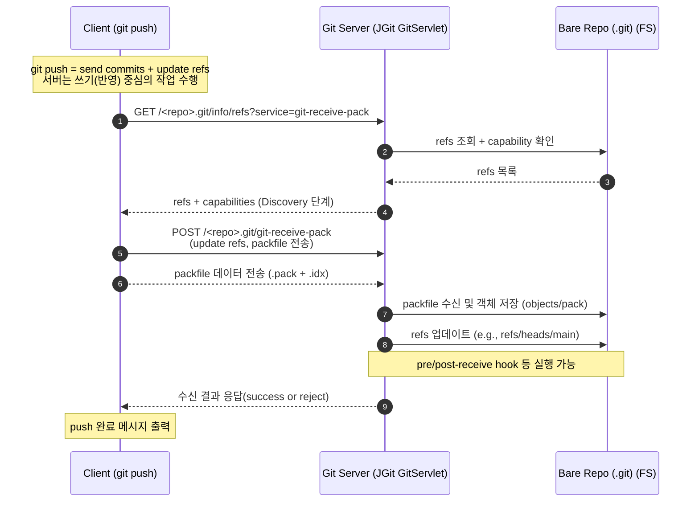

### Overview
---
클라이언트에서 `git push` 명령이 실행되면, 서버에서는 클라이언트로부터 전송된 커밋 및 객체를 수신하고 **Bare Repository**를 갱신한다. 

서버는 **쓰기 중심의 동작** 을 수행하며, 실제 Merge나 Rebase 없이 단순히 참조(refs)와 객체를 갱신한다.


### Key Terms Explained
---
- `Pack`: Git 객체를 효율적으로 저장하기위한 압축 파일 형식으로, `.pack` 파일과 인덱스역할을 하는`.idx` 파일로 구성된다.
- `Bare Repository`: `.git` 폴더만 존재하며, 작업 디렉터리(working tree)가 없는 저장소 형태로, 서버에서 원격 저장소로 사용된다.
- `git-upload-pack`: 클라이언트의 Push(혹은 Fetch) 요청을 처리하는 읽기 전용 엔드포인트
- `git-receive-pack`: 클라이언트의 Push 요청을 처리하는 쓰기 전용 엔드포인트

- `oid`: 


### Flow 
---

Git 클라이언트가 `git push` 통해 서버로 요청시 서버에서는 `git-upload-pack` API를 통해 **Bare Repository**를 갱신한다. (요청에 신규 커밋, 객체들 포함)

<!-- TODO: 충돌 발생  -->




### Flow Detail
---
#### 1. Discovery
르라이언트가 `git push` (Smart HTTP방식)을 수행하면, 내부적으로 서버의 `git-upload-pack` 엔드포인트로 refs 정보를 요청한다.


##### 1-1. 클라이언트 요청 
``` bash
GET /<repo>.git/info/refs?service=git-upload-pack
```


##### 1-2 서버 응답
서버는 Bare Repository의 내부 정보를 조회해 브랜치정보, 태그정보를 응답한다.


<!-- 이에 대한 응답으로 서버는 아래 포맷 `pkg-line`을 스트림으로 응답한다. -->
<!-- 서버는 파일 시스템 내 Bare Repository를 탐색해 아래 정보를 클라이언트에게 전달한다. -->
- HEAD
- refs/heads/* (브랜치정보)
- refs/tags/* (태그정보)

> 이 과정을 ref광고(Discovery) 라고 칭하며, 클라이언트가 이후에 Fetch 요청을 구성할 수 있도록 정보를 제공한다.


#### 2. Upload
##### 2-1. Calculating
위 과정을 통해 서버로부터 `ref` 정보를 받아, 클라이언트에서 어떤정보를 전송해야하는지 클라이언트에서 판단을 진행한다. `Discovery` 절차에서받은 server의 `oid`와 로컬의 `oid`를 가져와 어느정도의 변경사항을 업로드해야하는지 결정하는데 로컬의 `oid`가 서버의 `oid`보다 후순위인 경우
로컬은 서버의 이력을 fetch 해야하므로 reject 된다.


##### 2-2. Createing Packfile
만약, 

##### 2-3. Consistency Body
##### 2-4. Post


#### 2. Fetch 
클라이언트는 Discovery 단계에서 받은 refs 정보를 바탕으로, 서버가 가지고 있지만 로컬에는 없는 커밋들을 요청한다.
``` bash 
POST /<repo>.git/git-upload-pack
```
- 요청에는 `want`, `have`, `shallow` 옵션 등이 포함된다.


#### 3. Negotiation (비교를 통한 동기화 결정)
- 클라이언트와 서버간의 refs 정보를 비교(handshake)
- 로컬에 없는 객체만 선별후 요청(효율적 데이터 전송)
- 서버는 필요한 객체를 계산한 후 packfile을 생성하여 응답


#### 4. Packfile 전송 및 수신
서버는 side-band 스트림을 통해 데이터를 전송한다.

| 채널 | 내용 |
| -------------- | --------------- |
| ch1 | pack 데이터 |
| ch2 | 진행률 정보 |
| ch3 | 오류 메세지 |

클라이언트는 수신한 `.pack` 파일을 로컬 객체 DB에 반영하고 인덱스를 작성한다.


#### 5. Merge or Rebase
Fetch가 완료되면, 클라이언트는 로컬 브랜치와 병합하거나 리베이스를 수행해 최종적으로 로컬 상태를 갱신한다.


### Conclusion
---
1. 서버는 refs 정보를 제공
2. 클라이언트는 이를 기반으로 필요한 객체만 요청함.
3. 서버는 Pack 파일을 생성 및 응답해 효율적 동기화를 지원
4. 최종적으로 클라이언트는 Pack 파일을 받아 Merge나 Rebase를 수행함


<br>
<br>


### Overview
---
클라이언트에서 `git push` 명령이 실행되면, 서버에서는 클라이언트로부터 전송된 커밋 및 객체를 수신하고 이를 **Bare Repository에 반영(쓰기 작업)** 한다.  
즉, 서버는 **쓰기 중심의 동작(write operation)** 을 수행하며, 실제 Merge나 Rebase 없이 단순히 참조(refs)와 객체를 갱신한다.

### Key Terms Explained
---
- `Pack`: Git 객체를 효율적으로 저장하기 위한 압축 파일 형식으로, `.pack` 파일과 인덱스 역할을 하는 `.idx` 파일로 구성된다.  
- `Bare Repository`: `.git` 폴더만 존재하며, 작업 디렉터리(working tree)가 없는 저장소 형태로, 서버에서 원격 저장소로 사용된다.  
- `git-upload-pack`: 클라이언트의 Pull(혹은 Fetch) 요청을 처리하는 **읽기 전용** 엔드포인트  
- `git-receive-pack`: 클라이언트의 Push 요청을 처리하는 **쓰기 전용** 엔드포인트  

### Flow
---

Git 클라이언트가 `git push`를 수행하면, 서버에서는 `git-receive-pack` 엔드포인트를 통해 쓰기 요청을 처리한다.  
이 과정에서 서버는 새로운 커밋과 객체를 받아 Bare Repository에 반영한다.


Flow Detail
1. Discovery

클라이언트가 git push를 수행하면, 내부적으로 서버의
git-receive-pack 엔드포인트로 refs 정보를 요청한다.

1-1. 클라이언트 요청
GET /<repo>.git/info/refs?service=git-receive-pack


서버의 참조(refs) 상태를 조회해 어떤 브랜치를 업데이트할 수 있는지 확인한다.

1-2. 서버 응답

서버는 Bare Repository 내에서 아래 정보를 조회해 클라이언트에 전달한다.

HEAD

refs/heads/* (브랜치 정보)

refs/tags/* (태그 정보)

이 과정을 ref 광고(Discovery) 라 하며,
클라이언트는 이 정보를 바탕으로 어떤 브랜치에 커밋을 반영할지 결정한다.

2. Packfile 전송 (Push Data)

클라이언트는 서버가 광고한 refs를 기준으로,
변경할 브랜치와 커밋을 지정하고 새로운 객체를 packfile 형태로 전송한다.

POST /<repo>.git/git-receive-pack


요청에는 다음 정보가 포함된다:

항목	설명
old-oid	기존 커밋 해시
new-oid	새로 푸시할 커밋 해시
ref name	업데이트할 브랜치 이름

실제 커밋, 트리, 블롭 데이터는 .pack 파일에 압축되어 전송된다.

.idx 파일은 packfile 인덱스 역할을 수행한다.

3. 수신 및 검증 (Receiving Objects)

서버는 클라이언트가 전송한 packfile을 수신한 뒤 다음 과정을 수행한다.

.pack 및 .idx 파일을 objects/pack/ 디렉터리에 저장

모든 객체의 무결성(SHA-1 또는 SHA-256) 검증

업데이트하려는 ref가 fast-forward 가능한지 확인

fast-forward가 불가능할 경우,
receive.denyNonFastForwards 설정에 따라 푸시가 거부될 수 있다.

4. refs 갱신 및 Hook 실행

검증이 완료되면 서버는 refs 정보를 갱신한다.

예:

refs/heads/main → 새로운 커밋 해시로 변경


경우에 따라 packed-refs 파일에 통합 저장될 수 있다.

그 후, 서버는 다음 훅(hook)을 순차적으로 실행한다:

Hook	역할
pre-receive	수신 전 정책 검증 (예: 권한, 브랜치 제한 등)
update	각 ref 업데이트 시 개별 실행
post-receive	성공 후 후처리 (예: CI/CD 트리거, 알림 등)

이를 통해 서버는 푸시 후 자동 빌드, 배포, 알림 시스템과 연계할 수 있다.

5. 결과 응답 (Result)

모든 처리가 끝나면 서버는 결과를 클라이언트에 반환한다.

상태	설명
ok	푸시 성공
ng	푸시 거부 (예: fast-forward 불가, 권한 문제 등)

클라이언트는 이를 기반으로 푸시 결과를 출력한다.

Conclusion

서버는 클라이언트의 Push 요청을 수신하고, packfile을 저장한다.

refs 정보를 갱신하고 필요 시 hook을 실행한다.

클라이언트는 서버 응답을 받아 푸시 성공 여부를 확인한다.

전체 과정에서 서버는 쓰기 중심(write operation) 으로 동작하며,
클라이언트의 변경사항이 원격 저장소에 반영된다.

🧠 요약

git push 시 서버는 git-receive-pack을 통해 객체를 수신하고 refs를 업데이트한다.

Bare Repository는 이 과정을 통해 클라이언트의 변경을 반영하지만, 작업 디렉터리(working tree)는 존재하지 않는다.

push 시에는 훅(hook) 실행이 가능하며, 이는 CI/CD 파이프라인의 주요 트리거 역할을 한다.

