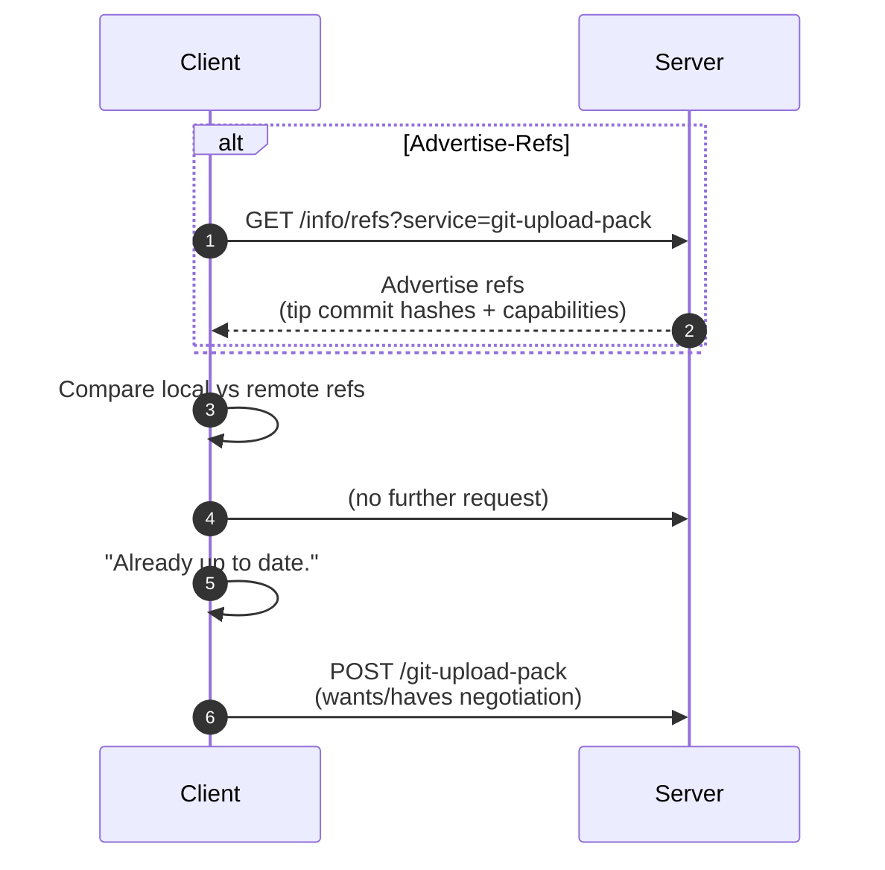

## Overview

git pull 혹은 git fetch 명령은 단순히 "서버에서 파일을 받기위한 명령이아니라, 형상정보를 제공받기전에, 양쪽 저장소의 그래프(커밋 DAG) 비교가 선행되어야 하며, 해당 단계를 Advertise-Refs라 하며, 해당포스트에서는 이에대한 내용을 설명함. 

## 단계


| 단계 | 역할 | 요청/응답 |
|------|------|------------|
| ① | Client → Server | `/info/refs?service=git-upload-pack` 요청 (GET) |
| ② | Server → Client | 각 브랜치의 tip SHA(최신 커밋 해시) |


### 1. 클라이언트 → 서버: /info/refs 요청

#### HTTP 요청 예시
```http
GET /okgit/git/CMPART/repo4.git/info/refs?service=git-upload-pack HTTP/1.1
Host: localhost:8084
User-Agent: git/2.47.0
Accept: */*
```

#### 클라이언트 내부 동작 (discovery)
1. `git pull` 명령 실행 시, 내부적으로 `git fetch` 호출  
1. 클라이언트는 `/info/refs` 엔드포인트로 **GET 요청** 


### 2. 서버 → 클라이언트: refs 광고 응답

###  2. 서버 → 클라이언트: refs 광고 응답
---

#### 서버 응답 예시 (HTTP Body)
```text
001e# service=git-upload-pack
0000
5451d6013b97bb6728ec8aa048ea208a9dae923a HEAD\0 include-tag multi_ack_detailed multi_ack ofs-delta side-band side-band-64k thin-pack no-progress agent=JGit/7.3.0 symref=HEAD:refs/heads/main
19f8d70c656327448e14978578f8864344584011 refs/heads/feature/login
d7dedb6ca08292dc602c36c2dd95ab0c1373c102 refs/heads/devs
0000
```

#### 주요 구성 요소
| 항목 | 설명 |
|------|------|
| `# service=git-upload-pack` | 이 서비스는 **fetch/pull용(upload-pack)** 이라는 선언 |
| `HEAD` | 현재 기본 브랜치(보통 main/master)가 가리키는 커밋 |
| `refs/heads/*` | 각 브랜치 이름 및 tip commit SHA |
| `\0` 이후 문자열 | 서버가 지원하는 **capability 목록** |
| `0000` | flush 패킷 (advertisement 종료) |

## 서버 동작방식

1. 클라이언트로부터 요청 수신 후 fetch 서비스 준비  
2. 저장소의 참조(ref) 목록 조회  
→ 브랜치와 태그 등 주요 참조 대상 확인  
3. 각 참조가 가리키는 최신 커밋 해시 수집  
4. 지원 기능(capabilities) 목록 정리  
5. 패킷 규격에 맞춘 광고 정보 전송  

- 단계 목적: 클라이언트의 동기화 필요 범위 파악  
- 전송 데이터: 참조 이름, tip 해시, 지원 기능 목록  
- 비전송 항목: 커밋 본문, 트리, 블롭 등 객체 데이터  

## Advertise-Refs 로그
---

#### Client TRACE
```text
16:03:05.716606 http.c:872 => Send header: GET /info/refs?service=git-upload-pack
16:03:05.799599 pkt-line.c:86 packet: git< # service=git-upload-pack
16:03:05.799616 pkt-line.c:86 packet: git< 5451d6... HEAD\0 include-tag ...
16:03:05.799637 pkt-line.c:86 packet: git< 2dd5b7... refs/heads/devs
16:03:05.799670 pkt-line.c:86 packet: git< 0000
```

#### Server TRACE
```text
[INFO] GET /okgit/git/CMPART/repo4.git/info/refs
[INFO] AdvertiseRefsHook advertiseRefs! discovery!: client: [::1]
[INFO] refKey: [refs/heads/devs] = d7dedb6c...
[INFO] refKey: [refs/heads/main] = 5451d6...
```


## Advertise-Refs 단계의 핵심 요약


| 관점 | 설명 |
|------|------|
| **클라이언트** | “서버야, 네가 가진 모든 브랜치의 최신 커밋 해시를 알려줘.” |
| **서버** | “내 main은 C, devs는 D, feature는 E야.” (각 tip SHA 광고) |
| **데이터 전송** | 오직 각 브랜치의 최종 커밋 해시 + capabilities |
| **이 단계에서 커밋 내용 전송?** | ❌ 전혀 없음 |
| **목적** | 이후 `upload-pack` 단계에서 필요한 커밋을 판단하기 위한 **사전 discovery 단계** |

<!-- <div align="center"><a href="/2025/09/16/bare-repository/#refs">그러면.. refs 는 어디에서 사용되는가?</a></div> -->


## Diagram




### Summary
---
`Adverties` 단계는 Git 프로토콜의 핵심토대라 할 수 있으며, 해당 요청 한번으로 어떤 브랜치가 존재하고 각 브랜치가 어느커밋을 가르키고있는지 클라이언트가 뭘해야하는지 알려주는 연계에 해당됨

