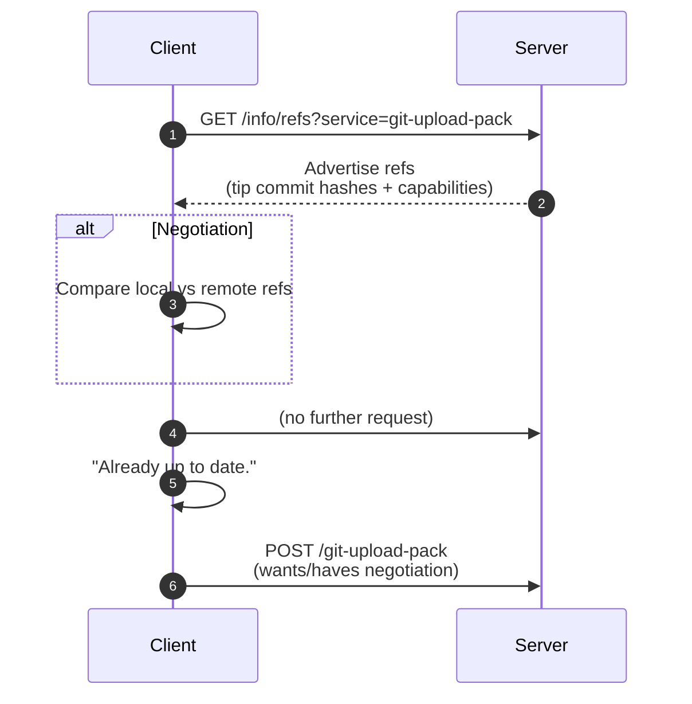

### Overview
---
Git의 fetch/pull 과정에서 Negotiation은 “클라이언트가 서버로부터 어떤 commit을 받아와야 하는지” 결정하기 위한 핵심 프로세스이며, 본문에서는 해당 내용에 대해 기술

<!-- Git에서 `fetch` 또는 `pull` 같은 동작이 발생할 때, 서버는 바로 모든 데이터를 보내지 않음 -->
<!-- Advertise-Refs → **Negotiation** → Packfile 전송이라는 일련의 단계를 통해 정말로 필요한(최소한의) commit과 object만 네트워크로 전송하기 때문 -->
<!---->
<!-- 즉, Negotiation은 Git이 효율적으로 버전 동기화를 수행하기 위한 핵심 알고리즘이다. -->

### What is Negotiation?
--- 
Negotiation이란, 클라이언트가 서버로부터 어떤 commit을 받아와야 하는지 결정하는 과정을 의미하며 이전 포스트에서 **Advertise-Refs** 절차를 통해받아온 `refs`정보를 기반으로 이미 가지고있는지 혹은 내가 모르는커밋인지(더 받아와야하는 커밋인지)를 판별하며 이 과정이 **Negotiation**을 의미한다. 그리고 이를 기반으로 want, have를 산출한다.  

1. 어떤 commit이 필요한지(want)
1. 어떤 commit을 이미 갖고 있는지(have)

<!-- 후자의 경우에만 서버에 "wants"와 "haves"를 보내 누락분의 Packfile 을 받아오기 -->

### Why?
---
Negotation 을 수행하는 요인은 **효율성** 때문 (네트웍 IO 최소화)
클라이언트는 서버에 내가 뭘갖고있고, 뭘 원하는지(want와 have)를 알려 서버가 딱 필요한 만큼의 데이터를 제공하도록 하기 위함이며  Negotiation은 두 정보를 만드는 과정이자 데이터 전송을 극단적으로 최적화하는 핵심 프로세스

<!-- 에대한 요청을 하는것이 아닌, 클라이언트가 없는부분만 요청하기 위해서이다. -->
<!-- Git의 Object 저장소는 DAG 즉, 단방향 그래프이기 때문 클라이언트와 서버는 서로 어떤 조상을 공유하는지 비교해야함 -->

### Flow
--- 
Advertise-Refs 이후, 클라이언트는 다음 네 가지 중 하나로 판단한다.  

#### Detail
##### 0) 서버로부터 refs 정보 수신

##### 1) DAG 탐색
클라이언트는 Advertised commit이 자기가 가진 commit graph안에 포함되어 있는지를 체크함.

##### 2) want 도출
- 포함 → up to date → 산출X
- 미포함 → 새로운커밋을의미 → want
포함케이스 즉, 클라이언트가 서버로부터 더이상 받아올 수 있다라고 판된되면, have 도출, Negotation 프로세스 뿐만 아니라 Pull/Fetch 프로세스가 전부 종료됨

##### 3) have 도출
클라이언트는 내가 가진 commit중에 서버도 알고 있을 것으로 판단되는 commit들을 have 목록에 넣음

#### Diagram

### Summary
---
Negotiation은 Advertise-Refs 이후, 클라이언트가 wants/haves 목록을 만드는 절차 >> 꼭 필요한 데이터만 요청하기위한 절차

