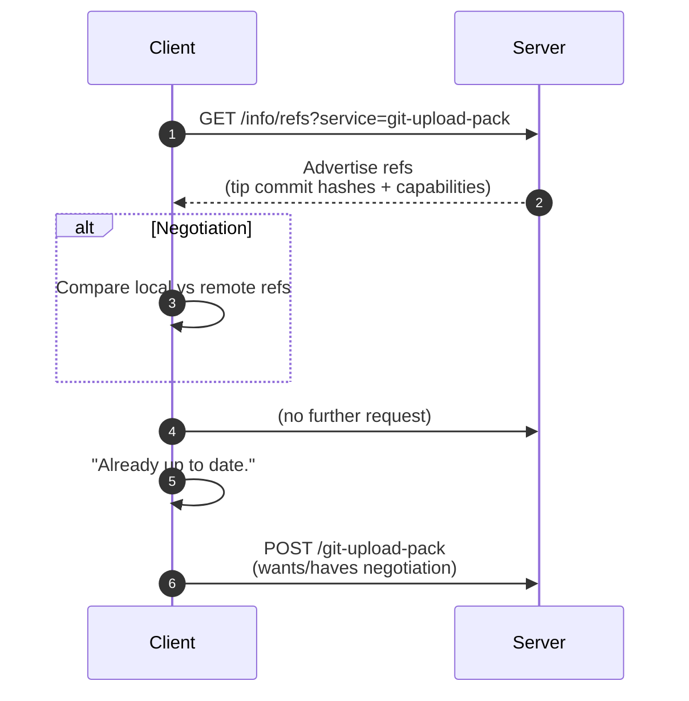

## Overview

Git의 fetch/pull 과정에서 Negotiation은 “클라이언트가 서버로부터 어떤 commit을 받아와야 하는지” 결정하기 위한 핵심 프로세스이며, 본문에서는 해당 내용에 대해 기술

## Negotiation란?

Negotiation이란, 클라이언트가 서버로부터 어떤 commit을 받아와야 하는지 결정하는 과정을 의미하며 이전 포스트에서 Advertise-Refs 절차를 통해받아온 refs정보를 기반으로 이미 가지고있는지, 혹은 내가 모르는커밋인지(더 받아와야하는 커밋인지)를 판별하며 이 과정이 Negotiation을 의미한다. 그리고 이를 기반으로 want, have를 산출한다.

1. 어떤 commit이 필요한지(want)
2. 어떤 commit을 이미 갖고 있는지(have)

## 왜?

Negotation 을 수행하는 요인은 **효율성** 때문 (네트웍 IO 최소화)
클라이언트는 서버에 내가 뭘갖고있고, 뭘 원하는지(want와 have)를 알려 서버가 딱 필요한 만큼의 데이터를 제공하도록 하기 위함이며 Negotiation은 두 정보를 만드는 과정이자 데이터 전송을 극단적으로 최적화하는 핵심 프로세스이다. 

## Flow

Advertise-Refs 이후, 클라이언트는 서버가 제공한 refs 정보를 토대로 wants, have를 도출하는 프로세스를 수행한다.

### 0) 서버로부터 refs 정보 수신

### 1) DAG 탐색
클라이언트는 Advertised commit이 자기가 가진 commit graph안에 포함되어 있는지를 체크.

### 2) want 도출

- 포함 → up to date → 산출X
- 미포함 → 새로운커밋을의미 → want 포함케이스 즉, 클라이언트가 서버로부터 더이상 받아올 수 있다라고 판된되면, have 도출, Negotation 프로세스 뿐만 아니라 Pull/Fetch 프로세스가 전부 종료됨

### 3) have 도출

클라이언트는 내가 가진 commit중에 서버도 알고 있을 것으로 판단되는 commit들을 have 목록에 넣음

## Diagram

## Summary
Negotiation은 Advertise-Refs 이후, 클라이언트가 wants/haves 목록을 만드는 절차 >> 꼭 필요한 데이터만 요청하기위한 절차

