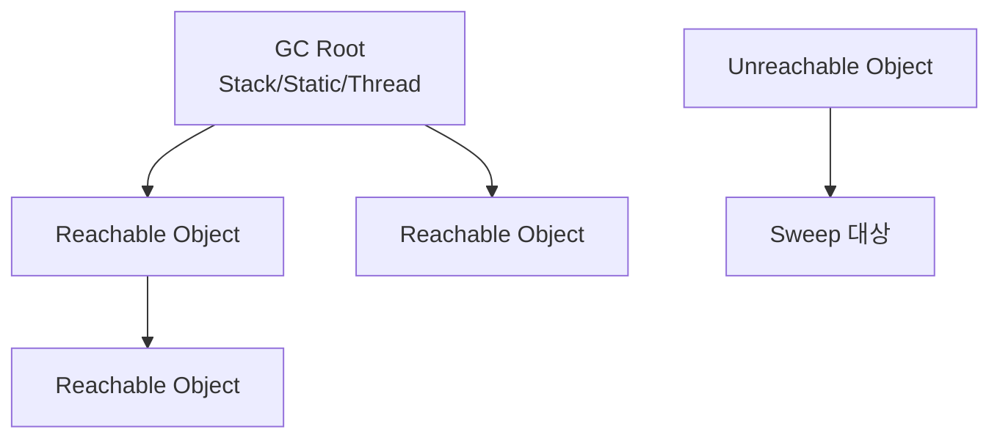

### overview
---

GC 어렵게 볼 필요 없음.
핵심은 "살아있는 객체만 남기고 나머지 치운다" 이거임.

### 1) GC를 왜 알아야 함?
---

웹 서비스 느려질 때
원인 중 하나가 GC pause임.

특히 p99 튈 때,
쿼리만 보지 말고 GC도 같이 봐야 함.

### 2) Mark and Sweep 한 줄 정의
---

- Mark: 살아있는 객체에 표시
- Sweep: 표시 안 된 객체 메모리 회수

끝.

### 2.5) GC 발동 조건 (짧게)
---

GC는 고정 주기로 도는 게 아님.
보통 아래 조건에서 발동함.

- Young 영역(Eden) 가득 참
- Old 영역 압박 증가
- 할당 속도가 회수 속도보다 빠름
- JVM/GC 휴리스틱이 회수 필요하다고 판단

즉, 시간 기준이 아니라 "메모리 압박 + 할당 패턴" 기준임.

### 3) 동작 순서
---

1. GC Root부터 시작
2. 도달 가능한 객체 전부 Mark
3. Mark 안 된 객체 Sweep

여기서 GC Root는 보통
- 스택 지역변수 참조
- static 참조
- 실행 중 스레드 참조

<!--

-->

### 4) 실무에서 체감되는 순간
---

GC가 도는 동안 일부 구간은 멈춤(STW) 발생 가능.

증상:
- 평균 latency는 괜찮음
- p95/p99만 순간적으로 튐
- 요청 타임아웃 간헐 발생

### 5) 자주 하는 오해 2개
---

오해 1) GC가 알아서 다 최적화해준다
- GC는 청소부임. 객체 생성/참조 구조가 나쁘면 한계 있음.

오해 2) 메모리 넉넉하면 GC 문제 없다
- 메모리 커도 pause 패턴/할당 속도 때문에 문제 날 수 있음.

### 6) 체크리스트 3개
---

- 객체를 오래 잡는 static/캐시 참조 있는지
- 불필요한 객체 생성이 급증하는 코드 경로 있는지
- GC 로그에서 pause time/p99 상승 구간 겹치는지

### 7) 요약
---

Mark and Sweep 핵심은 간단함.

- 참조 닿으면 생존
- 참조 끊기면 회수

실무 포인트는
GC 이론보다 "지연 구간과 GC를 같이 보는 습관"임.
